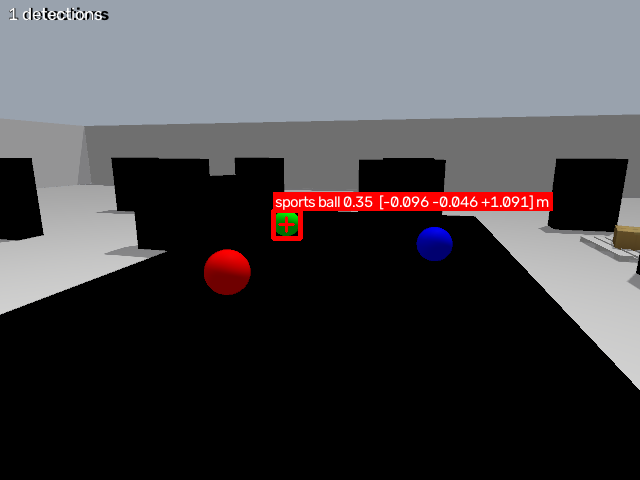

# Mobile Manipulator Warehouse Simulation (ROS 2 Humble)

A full-stack pick-and-place simulation system for a mobile manipulator
operating in a warehouse environment — built with ROS 2 Humble, Gazebo,
MoveIt 2, Nav2, and YOLOv8-based perception.

> 🎓 This project is part of my broader academic robotics journey.
> See the full portfolio here: **[Mobile Manipulator Simulation — Academic Project Journey](https://github.com/ZainAlabidinShbani/Mobile-Manipulator-Simulation-Academic-Project-Journey)**

---

## 🎥 Demo

_Coming once Phase 9 (full integration) passes._

In the meantime, here is the YOLOv8 perception stage running against the
simulated RealSense D435i wrist camera — the detected target is boxed and
its back-projected 3D position is broadcast as the `object_target_frame`
TF, measured at **2.2 mm** from the object's ground-truth pose:



---

## 🧠 What This Project Does

An autonomous mobile manipulator navigates a warehouse, detects a
target object using a YOLOv8 perception pipeline, plans and executes
a grasp with MoveIt 2, transports the object to a drop zone via Nav2,
and places it — all coordinated by an explicit ROS 2 state-machine
orchestrator with timeout/recovery handling.

**Full pipeline:**
`HOME → NAVIGATE TO OBJECT → PERCEIVE → GRASP → NAVIGATE TO DROP → PLACE → RETURN HOME`

The robot is a Clearpath Husky base carrying a Universal Robots UR5 arm,
a Robotiq 2F-85 gripper, an Intel RealSense D435i wrist camera, and a
front-mounted 2D lidar.

---

## 🏗️ System Architecture

| Package | Responsibility |
|---|---|
| `mobile_manipulator_description` | URDF/Xacro robot model (base + arm + gripper + camera + lidar), `ros2_control` integration |
| `mobile_manipulator_gazebo` | Gazebo warehouse world, robot spawn, `ros_gz` topic bridge, headless screenshot tooling |
| `mobile_manipulator_navigation` | Nav2 configuration, occupancy map, SLAM mapping route, autonomous navigation |
| `mobile_manipulator_moveit_config` | MoveIt 2 motion planning configuration (SRDF, kinematics, controllers) |
| `mobile_manipulator_perception` | YOLOv8-based object detection and TF publishing |
| `mobile_manipulator_orchestrator` | ROS 2 state-machine coordinating the full pick-and-place cycle |

`src/husky_description` is a vendored third-party base description
(cloned, not authored here) carrying two local patches — a plugin guard
and a wheel-friction fix without which the skid-steer base cannot rotate
in place.

This project was deliberately split into isolated, independently
verifiable subsystems rather than built as a single monolithic
pipeline — each phase (description → control → simulation → planning
→ navigation → perception → orchestration → integration → testing →
hardening) has its own pass/fail gate before the next one starts.

---

## 🛠️ Tech Stack

- **ROS 2 Humble**
- **Gazebo Fortress** (gz-sim 6, via `ros_gz` / `gz_ros2_control`)
- **MoveIt 2** (motion planning)
- **Nav2** (autonomous navigation, AMCL + DWB, slam_toolbox for mapping)
- **YOLOv8 / Ultralytics** (object detection)
- **Python (rclpy)** — orchestrator & perception nodes
- **Xacro / URDF** — robot description

> The simulation backend was migrated from Gazebo Classic to Gazebo
> Fortress after Classic reached end-of-life in January 2025. Every phase
> gate below was re-verified on the new backend.

---

## ✅ Progress

- [x] Workspace bootstrap — all packages build clean
- [x] Robot description — URDF verified in RViz
- [x] ros2_control — controllers active
- [x] Gazebo world — robot spawns and stabilizes
- [x] MoveIt 2 — planning group executes trajectories
- [x] Nav2 — autonomous navigation to goal pose
- [x] YOLOv8 perception — object detection + TF publishing
- [x] Orchestrator — full state-machine dry-run
- [ ] Full integration — one complete pick-and-place cycle
- [ ] Automated tests — colcon test green
- [ ] Hardening — 5 consecutive cycles unattended

**Measured results on the current (Gazebo Fortress) build:**

| Gate | Result |
|---|---|
| Simulation real-time factor | 0.995 |
| `ros2_control` controllers | 4 / 4 active |
| Camera / depth / lidar publish rate | 6.6 – 8.0 Hz |
| Nav2 final pose error | 0.104 m / 0.130 rad (tolerance 0.25 / 0.25), collision-free |
| Perception TF accuracy | 2.2 mm vs ground truth |
| Orchestrator dry-run | full sequence + forced-failure recovery path both correct |

---

## 🚀 Getting Started

```bash
git clone https://github.com/ZainAlabidinShbani/mobile_manipulator_ws.git
cd mobile_manipulator_ws

rosdep install --from-paths src --ignore-src -r -y

colcon build --symlink-install
source install/setup.bash
export ROS_LOCALHOST_ONLY=1
```

The single-command `warehouse_demo.launch.py` is the Phase 9 deliverable
and does not exist yet. Until then, bring the stack up in layers:

```bash
# 1. Gazebo warehouse + robot + controllers  (gui:=false for headless)
ros2 launch mobile_manipulator_gazebo gazebo_warehouse.launch.py

# 2. Autonomous navigation
ros2 launch mobile_manipulator_navigation nav2_bringup.launch.py

# 3. Motion planning
ros2 launch mobile_manipulator_moveit_config move_group.launch.py use_sim_time:=true

# 4. Perception
ros2 run mobile_manipulator_perception yolo_perception_node --ros-args -p use_sim_time:=true

# 5. Orchestrator — logic-only dry run, needs none of the above
ros2 run mobile_manipulator_orchestrator warehouse_orchestrator --ros-args -p dry_run:=true
```

---

## 📌 Why This Project

The interesting problem here was not any single subsystem — it was making
eight of them agree with each other. The design choice I would defend is
the phase gate: nothing proceeds until the previous stage passes a
concrete, measurable check, because in a stack this deep a silent failure
propagates for hours before it surfaces as something unrelated.

That paid off most clearly during the Gazebo Fortress migration. The Nav2
goal-tolerance check started failing by two centimetres, which looked like
a controller-tuning nuisance. It was not: the skid-steer odometry
calibration had been fitted against Gazebo Classic's ODE solver, and under
Fortress's DART solver the effective wheel track is different, so `/odom`
was under-reporting yaw by 20%. That bias rotated the SLAM map 17.7° away
from the world frame — a failure that reports no errors anywhere and only
becomes visible if you compare against simulator ground truth rather than
against the robot's own odometry. Measuring instead of guessing is the
part of this project I would carry into any other robotics system.

---

## 👤 Author

**Zain Alabidin Shbani**
Robotics & Intelligent Systems Engineering

---

## 🔗 Related Work

- [Full academic robotics journey (KUKA youBot, custom 3-DOF arm, and this project)](https://github.com/ZainAlabidinShbani/Mobile-Manipulator-Simulation-Academic-Project-Journey)
